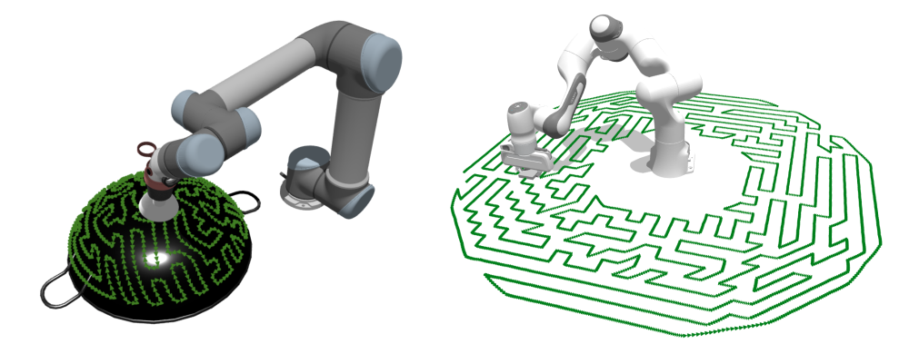
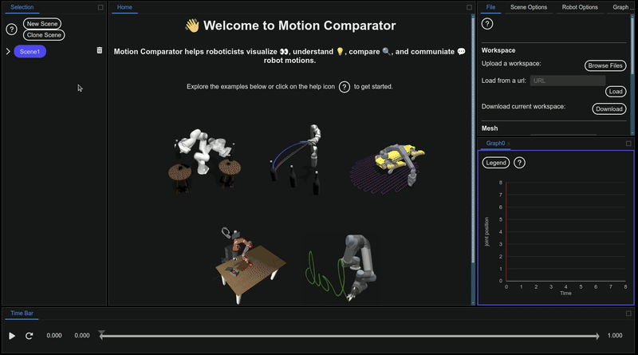

# Arm Coverage Path Planning

Implementation of our ICRA'25 paper: *Hierarchically Accelerated Coverage Path Planning for Redundant Manipulators*

[[Pre-print](https://arxiv.org/pdf/2502.19591.pdf)]  [[Poster](https://yepw.github.io/files/icra25_poster.pdf)]
<!--[[Supplementary Video](https://www.youtube.com/watch?v=_QVAetYbpEY)] [[Presentation Video](https://www.youtube.com/watch?v=IKy0Yda8p4)] -->




## Introduction

This is a coverage path planner for robotic arms. It efficiently computes arm motions for tasks such as wiping, sanding, and polishing, where the end effector must cover a surface.
<!-- For more information, please refer to [our paper](https://arxiv.org/pdf/2302.13935.pdf). -->

This code builds upon [RangedIK](https://github.com/uwgraphics/relaxed_ik_core) and [GLKH](http://webhotel4.ruc.dk/~keld/research/GLKH/). We modified the original GLKH to handle sparse graphs. 

This code was tested on Ubuntu 24.04. If you encounter a bug or would like to request a new feature, please open an issue.

## Getting Started 

1. [Install Rust](https://www.rust-lang.org/learn/get-started)
2. Compile Rust:
    ```bash
    cd arm_coverage
    cargo build
    ```
3. Comiple GLKH
    ```bash
    cd GLKH
    make
    cd ..
    ```
    Test GLKH following GLKH's readme
3. Run:
    ```
    python3 scripts/run_experiments.py
    ```
    This code processes the surfaces under `/surfaces/` and save motions under `/motions/`. By default, `run_experiments.py` runs three coverage path planners. <!-- For more information, please refer to [our paper](https://arxiv.org/pdf/2302.13935.pdf). -->

    | Coverage Path Planner    | Description |
    | -------- | ------- |
    | hrchy_gtsp  |  our proposed approach; efficient and effective   |
    | joint_gtsp |   baseline approach 1; slow and may not converge   |
    | cartesian_tsp    | baseline approach 2; fast but not optimal   |

### Visualize generated motions



* Open a scene

    Click and drag "Scene 1" in the upper left cornor to open it

* Add an iiwa robot

    In the panel on the right, under the "File" tab, locate the mesh section. Choose "iiwa" from the drop-down menu, then click the "confirm" button. An iiwa robot will be added to Scene 1.

* Upload the motion file

    In the panel on the right, under the "File" tab, locate the motion section. Click "Browse file", then choose your local file: panda_hrchy_gtsp_XXXXX.csv. Upload the selected file.

* Play the motion

    Click the play button located in the lower left corner to play the motion.

### Use your own robot
1. Place your robot's URDF under `configs/urdfs/`
2. Make a setting file. Examples are under `configs/example_settings`

## Citation
```
@article{wang2025hierarchically,
  title={Hierarchically Accelerated Coverage Path Planning for Redundant Manipulators},
  author={Wang, Yeping and Gleicher, Michael},
  booktitle={2025 IEEE International Conference on Robotics and Automation (ICRA)},
  year={2025}
}
```
